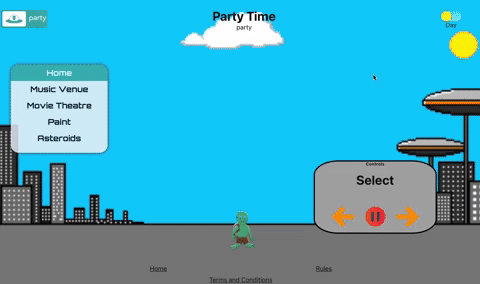

# ThePartyTime

This is a simple game that deals with the change between day/night mode and what events are available for use during each period. It turned out to be a really fun process, and I really enjoyed some of the aspects of the build. There are still parts of it that are unfinished and are going to be built out more in the future.

## Table of contents

  - [Screenshot](#screenshot)
  - [My process](#my-process)
  - [Built with](#built-with)
  - [What I learned](#what-i-learned)
  - [Useful resources](#useful-resources)
  - [Author](#author)


### Screenshot




### Built with

- Semantic HTML5 markup
- CSS custom properties
- Flexbox
- JavaScript
- ReactJS
- Express

### What I learned

There were a few challenges to overcome with this project. I learned that there are a lot of useful functions and resources already available out there. I learned how 2D games performed the motions needed, and I learned a lot about CSS. There were multiple layers to some of the backgrounds which really had me thinking outside the box, especially with fixed control panels layered in front of them.

Below is a code snippet that shows how I was able to show which direction my character was facing. 


```js
function moveLeft() {
        const x = document.getElementById('AlienFWD') 
        const y = document.getElementById('AlienLeft')
        const z = document.getElementById('AlienRight')
        if(y.style.display === 'block') {
            x.style.display = 'block';
            y.style.display = 'none';
            z.style.display = 'none';
        } else {
            x.style.display = 'none'
            y.style.display = 'block';
            z.style.display = 'none';
        }
    }
    function moveRight() {
    var x = document.getElementById('AlienFWD')
    var y = document.getElementById('AlienRight')
    var z = document.getElementById('AlienLeft')
        if(y.style.display === 'block') {
            x.style.display = 'block';
            y.style.display = 'none';
            z.style.display = 'none';
        } else {
            x.style.display = 'none';
            y.style.display = 'block';
            z.style.display = 'none';
        }
    }
    function moveDefault() {
        var x = document.getElementById('AlienFWD')
        var y = document.getElementById('AlienRight')
        var z = document.getElementById('AlienLeft')
        if(x.style.display === 'none') {
            x.style.display = 'block';
            y.style.display = 'none';
            z.style.display = 'none';
        } 
    }
```

### Useful resources

- [W3Schools](https://www.w3schools.com/) - This has always been one of my go to's for any project that I have a minor question on.
- [Stack Overflow](https://stackoverflow.com/) - Stack overflow is an amazing resource where most of the questions that you could possibly have, have already been answered.
- [Piskel](https://www.piskel.com/) - This is the site I used to make all the custom gifs for my project. It started out fairly challenging, but after making two or three of them it started to go a lot faster.

## Author

- Website - [Peter Hellwege](http://peters-portfolio.net/)


